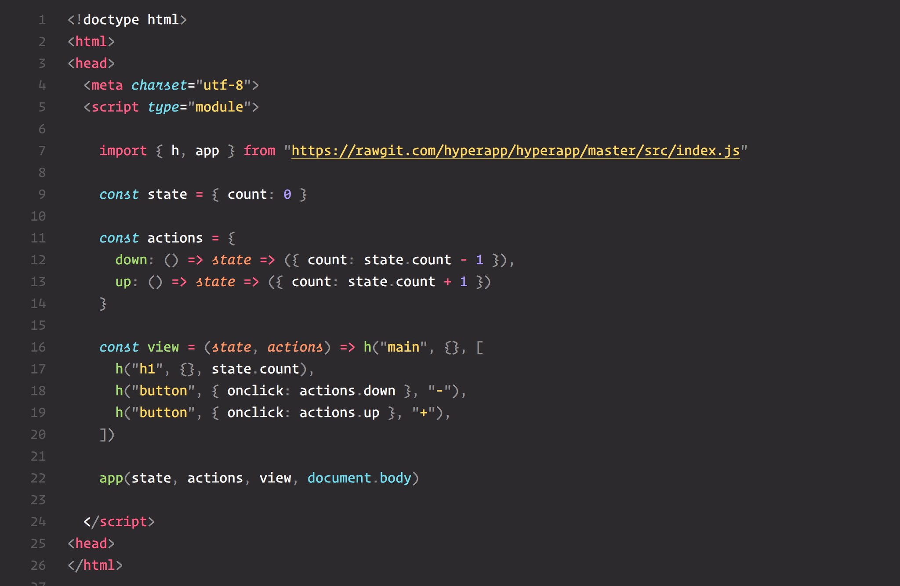
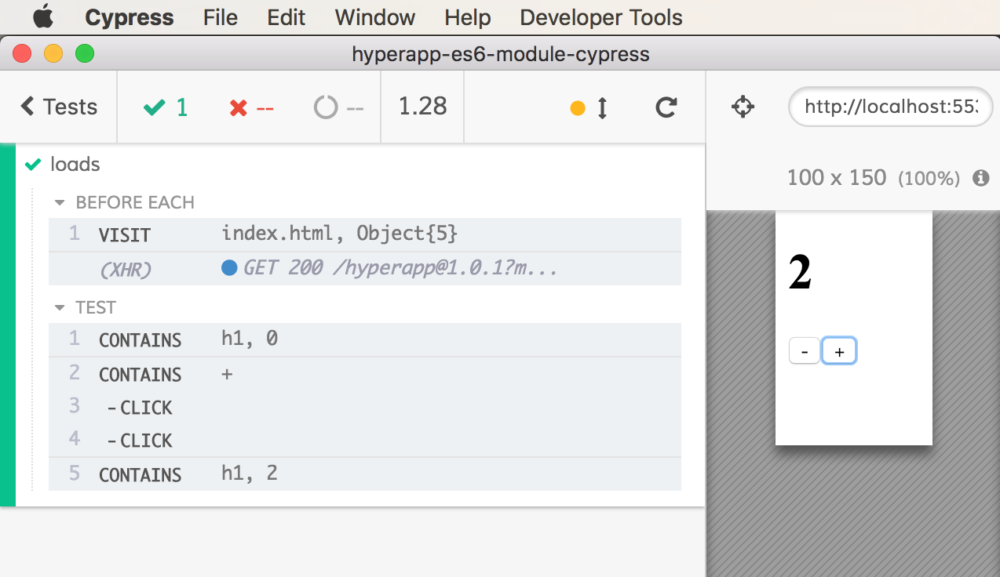

# hyperapp-es6-module-cypress

> Testing Hyperapp with ES6 module import in Cypress example

If your application uses `<script type="module">` and you pick Electron browser in [Cypress](https://www.cypress.io) end-to-end test runner, the app won't run. This example shows how to add ES6 module support to the Electron browser from your tests.

Example: mini app importing Hyperapp framework as a module



The test [spec.js](cypress/integration/spec.js) loads modules from [dist](dist) folder that add ES6 support

```js
const addScript = (document, src) => {
  // force immediate load
  document.write(`<script src="${src}"></script>`)
}
// load es6 module bundler from
// https://github.com/ModuleLoader/browser-es-module-loader
// we built the "dist" folder ourselves
beforeEach(() => {
  cy.visit('index.html', {
    onBeforeLoad: win => {
      addScript(win.document, 'dist/babel-browser-build.js') // must be first
      addScript(win.document, 'dist/browser-es-module-loader.js')
    },
  })
})
// tests
```

And now the tests run in Electron browser


